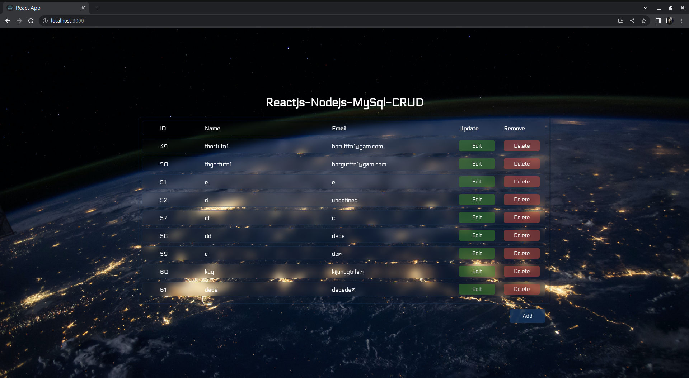
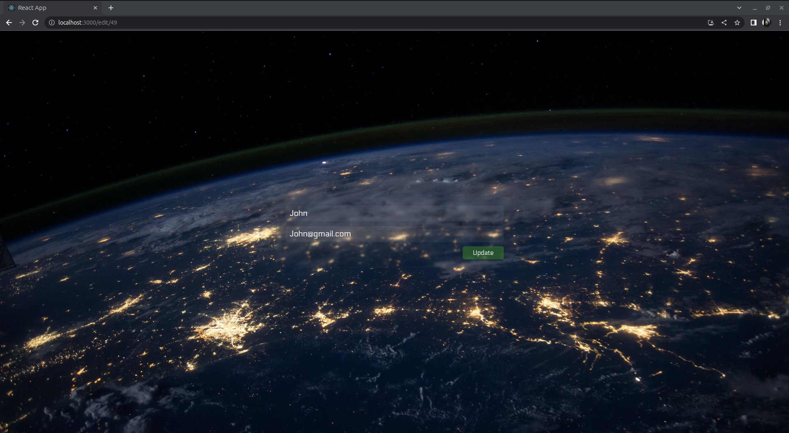
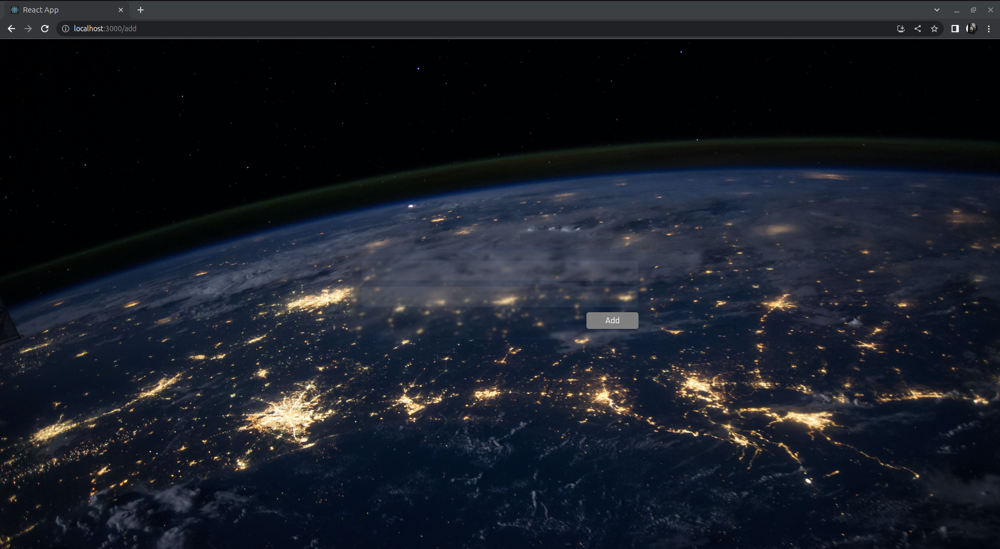
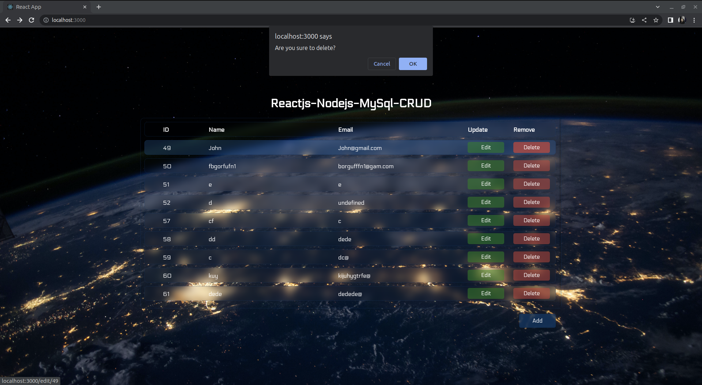

# Reactjs-Nodejs-MySql-CRUD

### Simple crud app with

- React
- Node
- MySql

**_Why I build this application?_**

To review what I know and I wanted to practice the MySql after getting Oracle badge:

This not advanced app, but It helped me to remember some important things, nothing complicated here.

### Belov is the home page of the app, listing all users (in code I called them students, because I used student database on mysql):

### Updating user:

### Add user:

### Delete user (asks before deleting user):

I haven't deployed and written test yet :)
